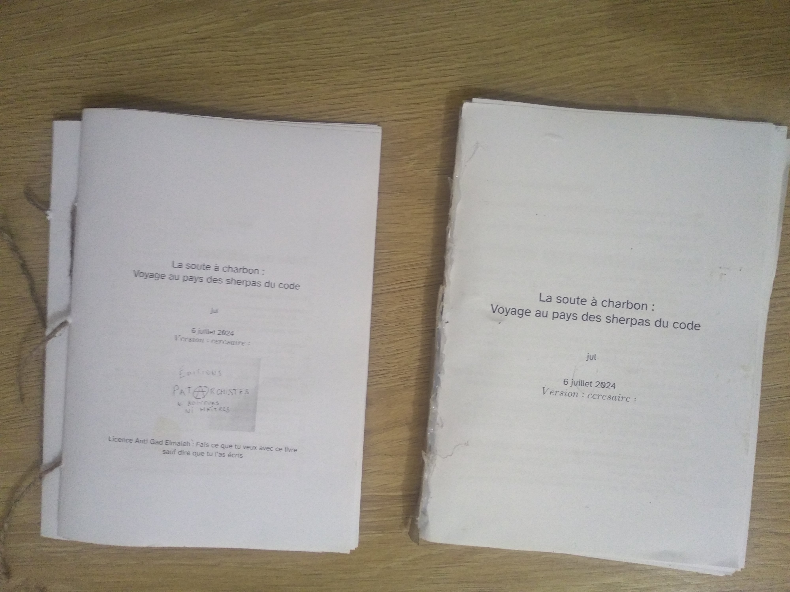

# Faire un livre A5 avec une imprimante recto A4

Faire un pdf lisible sur ordinateur, c'est bien, mais on veut parfois aussi se
faire un petit format qui encombre moins et coûte moins cher. Et puis vu que le
reprographe en ville prend 20 centimes la page là où mon imprimante laser est à
5 centimes et la feuille de papier à 1,5 centimes, et prend la reliure à 4 € là
où un pistolet à colle fait l'affaire, alors, pour les petites séries on est
tenté de le faire à la main.

Ici, je fournis dans la chaîne de production incluse un petit utilitaire
`mkbooklet.sh` qui transforme une suite linéaire de feuille A4 en format 2 par 2
par lot de 16 feuillets consécutifs. Ce qui permet de brocher puis coller les
brochures contre un carton ce qui fait amplement l'affaire.

C'est très root, c'est probablement le style le plus hipster que vous pouvez
trouver en ville.

{width=10cm}

Avec ça, je pense avoir couvert la partie qui ne dépend pas de votre plume, de
l'édition, jusqu'à la reliure.

