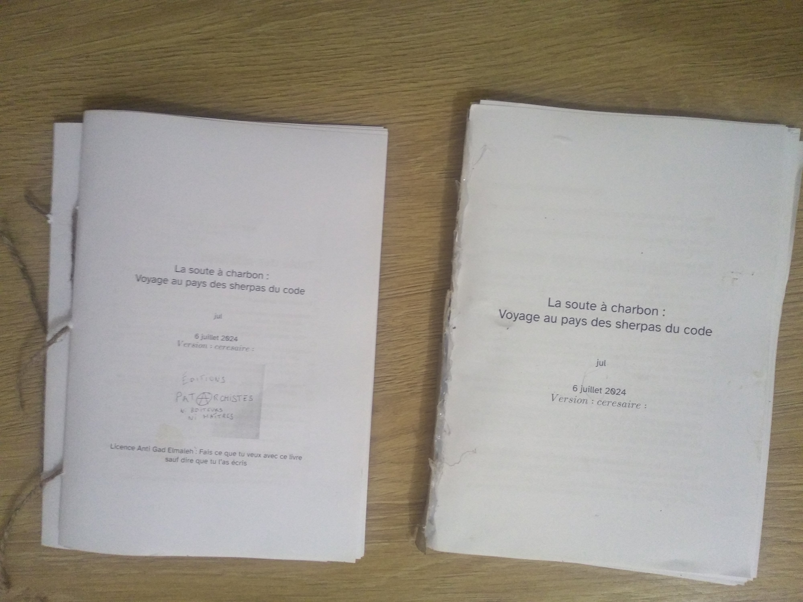

# Introduction

Qui n'a jamais rêvé de pouvoir écrire des choses aux kilomètres dans une
console et se concentrer sur ce que l'on veut dire et non où couper les
mots, le nombre de caractères par lignes et avoir une sortie chiadée ?

Jusqu'à présent la qualité «PAO» était réservé à des logiciels forts
dispendieux, mais, et si on pouvait écrire un livre avec ... quasi rien
(si on passe sous silence les 3Gbs d'installation de latex) ?

Comment je me débrouille à partir d'ici ? - pour dupliquer ça chez moi -
comment je le fais fonctionner ? - comment je le modifie ?

[Le résultat généré est ici et le lien visible à la fin dans la liste
des
liens](https://github.com/jul/faire_un_livre/blob/main/doc/livre.pdf)

# Pré-requis et clonage

[Que vous soyez sous linux ou windows, mes outils favoris sont inclus
quand vous installez le client git](https://git-scm.com/downloads).
Surtout sous windows.

L'explorateur de fichier sous windows vous permet dorénavant de faire un
click droit sur un dossier et de faire « git bash here », et vous allez
faire

        git clone https://github.com/jul/faire_un_livre.git

et maintenant faîtes

        cd faire_un_livre

Dans ce répertoire il y a un fichier : `02_quickstart` et bien ... c'est
celui que vous lisez en ce moment.

Pour les utilisateurs de windows qui vont avoir besoin de latex, je
recommande chaudement l'utilisation de [l'installeur en ligne de
commande scoop pour windows](https://github.com/ScoopInstaller/Scoop) ou
[l'installeur en ligne de commande choco pour
windows](https://chocolatey.org/install#individual)

D'ailleurs, j'incite tout le monde à se renseigner et/ou modifier ce
texte sur comment installer pandoc et pdflatex qui vont être nécessaires
pour la suite.

Note : que ce soit *choco, scoop (windows), pkg (debian) ou apt (BSD)*
on installe les logiciels libres en faisant
`installer install nom_du paquet` et oui installer latex sur windows
peut se faire avec `choco install xetex`.

Pour FreeBSD, il n'y a pas de package pdflatex il faut installer texlive
et texformats : `pkg install texlive-texmf tex-formats tex-dvipsk`

## Logiciels requis et optionnels

Le fichier qui fait la magie d'assembler le texte est `mkdoc.sh` il
aggrège les fichiers XX_whatever.md ou XX est un chiffre dans l'ordre et
il en fait un livre en utilisant `pandoc`.

Comme les autres logiciels il peut être installé avec
`choco install pandoc`.

[Le logiciel pandoc a un site clair mais ... en
anglais](http://pandoc.org)

[J'ai pu trouvé un cours pas dégueu (il semble avoir été donné à l'EPFL)
sur le sujet de pandoc et
markdown](https://www.jdbonjour.ch/cours/markdown-pandoc/)

Normalement, lua (un langage de programmation fort agréable) est
normalement installé comme dépendance de *pandoc* et sert à faire des
filtres.

Python est en dépendance optionnelle pour faire des filtres avancés (le
générateur de la liste des liens en fin de document) et la génération de
versions. *mkdoc.sh* s'en passe très bien. Par contre lui tourne sur
bash, donc ... on revient à la case intiale : installez git client qui a
90% des dépendances nécessaires à utiliser le code source nécessaire à
générer le livre.

## Conseil pour l'édition

Utilisez un éditeur qui est capable de forcer les retours à la ligne à
80 colonnes. J'ai vim mon vimrc pour contient :

    augroup myformatting
        autocmd Filetype markdown set tw=80
        autocmd BufEnter *md normal ggG<CR>
    augroup END

# Génération

Normalement, vous avez bash et vous tapez simplement :

        ./mkdoc.sh

là dans le répertoire `doc` est apparu `./doc/livre.pdf`

La magie s'opère ainsi

-   les fichiers terminants par md sont tous mis dans l'ordre
    alphabético-numérique dans un gros fichier ;
-   on leur adjoint un en-tête contenant le titre ;
-   on leur adjoint la table des contenus automatiquement générée.

Il est possible d'ajouter des listes de tableaux et ou des
illustrations.

# modifier

Le fichier `titre_md` contient ce qui permet de faire le titre

Le format des fichiers est en syntaxe « markdown » dont la syntaxe est
documentée ici :
<https://docs.github.com/fr/get-started/writing-on-github/getting-started-with-writing-and-formatting-on-github/basic-writing-and-formatting-syntax>

Les fichiers `xx_*md` sont les fichiers qui composent se livre.

Pour générer un livre, il suffit d'installer tout les logiciles
nécessaires (tex, latex, pdflatex, pandoc) en plus de ceux que vous avez
déjà, et ensuite `./mkdoc.sh` vous générera la suite.

# Pandoc et python : faire des filtres

Alors, pourquoi ne pas utiliser l'excellent pandocfilters et panflute ?

Parce que panflute est plus idiomatiquement proche des filtres lua ou
haskell pour pandoc, et c'est un grand avantage, mais si pandocfilters
est parfait pour faire des filtres simples du type pourt tout élément
faire un truc simple, pour les choses qui nécessitent de modifier le
document *genre pour rajouter un index* c'est plus compliqué.

Or, en voulant faire un livre qui se voulait accessible, je me suis
aperçu qu'en PDF les liens n'étaient ni visibles, ni leurs URLs. Donc,
comme un grand j'ai décidé de coder mon propre filtre.

Deux choses aident :

-   [la documentation de pandoc est claire quoique
    concise](https://pandoc.org/filters.html)
-   [on trouve beaucoup de question réponses sur pandoc sur
    stackoverflow](https://stackoverflow.com/questions/tagged/pandoc?tab=Votes)

## Pandoc et lua

Lua est un langage de programmation clair assez basique avec lequel il
est dur de se tirer une balle dans le pied.

Sa syntaxe qui rappelle un peu pascal (function/if//end, et les index de
tableau à 1) n'est pas sans déplaire.

Un filtre lua simple est un filtre qui pour un type d'objet pandoc (tel
qu'exposé dans la sortie JSON) fait correspondre une manipulation
simple.

### Cas d'étude : j'ai un tic de langage je dis « bref » tout le temps

PROUT je ne veux plus voir « bref » dans mes sorties !

le filtre lua suivant que l'on enregistra dans bref.lua :

``` lua
function Str (el)
  if el.text:match 'Bref' then
    return "PROUT"
  end
end
```

Retourne PROUT à chaque fois qu'il voit « PROUT » seul.

On l'appelle dans la chaîne de production avec
`pandoc --lua-filter bref.lua input.whatever -o output.peu_importe`

### Filtre complexe (avec mémoire) rajouter une liste des liens

Le PDF c'est bien, c'est cliquable.

Mais, quand on imprime un PDF, les liens deviennent invisible ... si
seulement on pouvait rajouter une table de lien avec *panflute*.

[Panflute est un module python bien documenté pour faire des filtres
pandoc](https://scorreia.com/software/panflute/) et l'exemple qui suit
est dérivé directement du code d'exemple :

```{=tex}
\newpage
```
``` python
#!/usr/bin/env python
from panflute import *

toc = None
def prepare(doc):
    global toc
    toc = DefinitionList()

def action(elem, doc):
    global toc
    if isinstance(elem, Link):
        _def = elem.url
        item =  DefinitionItem([ 
            Str(_def)],
            Definition(
                Plain(
                    Str(
                        f"{stringify(elem.content)}"
            )))], )
        toc.content.insert(-1,item)

def finalize(doc):
    ttoc = Div(
        Header(Str("Liste des liens")),
        toc
    )
    doc.content+=  [ ttoc ]

def main(doc=None):
    return run_filter(action, prepare=prepare, finalize=finalize, doc=doc)


if __name__ == '__main__':
    main()
```

# Accessibilité

En sortant, l'autre jour, je suis tombé sur quelqu'un qui aurait bien
aimé lire, une épreuve faite avec ce gabarit, mais ... La fonte et sa
taille n'aidait pas.

Je me dis que ce serait bien qu'en tant qu'informaticien, j'essaie
d'aider un peu donc j'ai fait mes recherche et j'ai rajouté une sortie
avec une [fonte conçue par l'institut
braille](https://brailleinstitute.org/freefont) pour faciliter la
lecture pour les dys-voyants et mal-voyants.

Fonte qu'il va vous falloir télécharger et installer si vous voulez
générer le livre en format « lisible ».

# Versioner

La commande *versioner.sh* va introduire une chaîne aléatoire qui tente
d'être prononçable après la date sur la couverture.

Cela permet à ceux qui utilisent un gestionnaire de version comme moi de
pouvoir remonter dans le passer faire les corrections et envoyer un cout
de *git rebase -i* pour propager les corrections faîtes sur une ancienne
version.

Le fichier history.txt donne le hash de la révision git correspondant au
commit précédent l'introduction de la version. Ça marque la révision qui
vient d'être révolue.

# Faire un livre A5 avec une imprimante recto A4

Faire un pdf lisible sur ordinateur, c'est bien, mais on veut parfois
aussi se faire un petit format qui encombre moins et coûte moins cher.
Et puis vu que le reprographe en ville prend 20 centimes la page là où
mon imprimante laser est à 5 centimes et la feuille de papier à 1,5
centimes, et prend la reliure à 4 € là où un pistolet à colle fait
l'affaire, alors, pour les petites séries on est tenté de le faire à la
main.

Ici, je fournis dans la chaîne de production incluse un petit utilitaire
`mkbooklet.sh` qui transforme une suite linéaire de feuille A4 en format
2 par 2 par lot de 16 feuillets consécutifs. Ce qui permet de brocher
puis coller les brochures contre un carton ce qui fait amplement
l'affaire.

C'est très root, c'est probablement le style le plus hipster que vous
pouvez trouver en ville.

{width="10cm"} {width="10cm"} {width="10cm"}

Avec ça, je pense avoir couvert la partie qui ne dépend pas de votre
plume, de l'édition, jusqu'à la reliure.

# Références

-   syntaxe bash <https://tldp.org/LDP/abs/html/>
-   la documentation markdown
    <https://docs.github.com/fr/get-started/writing-on-github/getting-started-with-writing-and-formatting-on-github/basic-writing-and-formatting-syntax>
-   le site où trouver ce livre et comment le fabriquer
    <https://github.com/jul/faire_un_livre>

<div>

# Liste des liens

https://git-scm.com/downloads
:   Que vous soyez sous linux ou windows, mes outils favoris sont inclus quand vous installez le client git

https://github.com/ScoopInstaller/Scoop
:   l'installeur en ligne de commande scoop pour windows

https://chocolatey.org/install#individual
:   l'installeur en ligne de commande choco pour windows

http://pandoc.org
:   Le logiciel pandoc a un site clair mais ... en anglais

https://www.jdbonjour.ch/cours/markdown-pandoc/
:   J'ai pu trouvé un cours pas dégueu (il semble avoir été donné à l'EPFL) sur le sujet de pandoc et markdown

https://pandoc.org/filters.html
:   la documentation de pandoc est claire quoique concise

https://stackoverflow.com/questions/tagged/pandoc?tab=Votes
:   on trouve beaucoup de question réponses sur pandoc sur stackoverflow

https://scorreia.com/software/panflute/
:   Panflute est un module python bien documenté pour faire des filtres pandoc

https://brailleinstitute.org/freefont
:   fonte conçue par l'institut braille

https://github.com/jul/faire_un_livre/blob/main/doc/livre.pdf
:   Le résultat généré est ici et le lien visible à la fin dans la liste des liens

</div>
